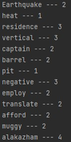

# SyllableCounter

A small app the counts the syllables for given words. A bit trickier than you would think.

counting syllables for the english language isn't as easy as it might seem and the way you were taught in primary school like the clapping method or the chin method has their flaws and are not completely accurate. It is certainly hard to program an app that would subjectively count the number of claps or chin movements a human might count for a syllable therefore our programmatic approach has to take the word by letters and algorithmically deduce the number of syllables for any given word.

our syllable counter uses the written method rule which counts the number of vowels plus the letter y in the word and reduces the count if the program detects silent vowels, the number of diphthong and triphthongs or certain words which end in "es". The program also adds to the count for other certain words ending in "le" or "ing" as well which outputs the relatively correct number of vowels for the user.

This program has been tested with over one hundred unique test cases to give the best and most accurate count which compared to other top industry syllable counters like from syllablecounter.com, our program comes within a 99% accuracy margin.

## How to Run
**Compile:**

`javac Syllables.java`

**Run:**

* linux
  * `java Syllables` to type your own words or use the given examples `java Syllables < test-cases.txt`
* PowerShell
  * `java Syllables` to type your own words or use the given examples `Get-Content test-cases.txt | java Syllables`

## example

| input  | output |
| --- | --- |
| java Syllbales < test-cases.txt |  |

